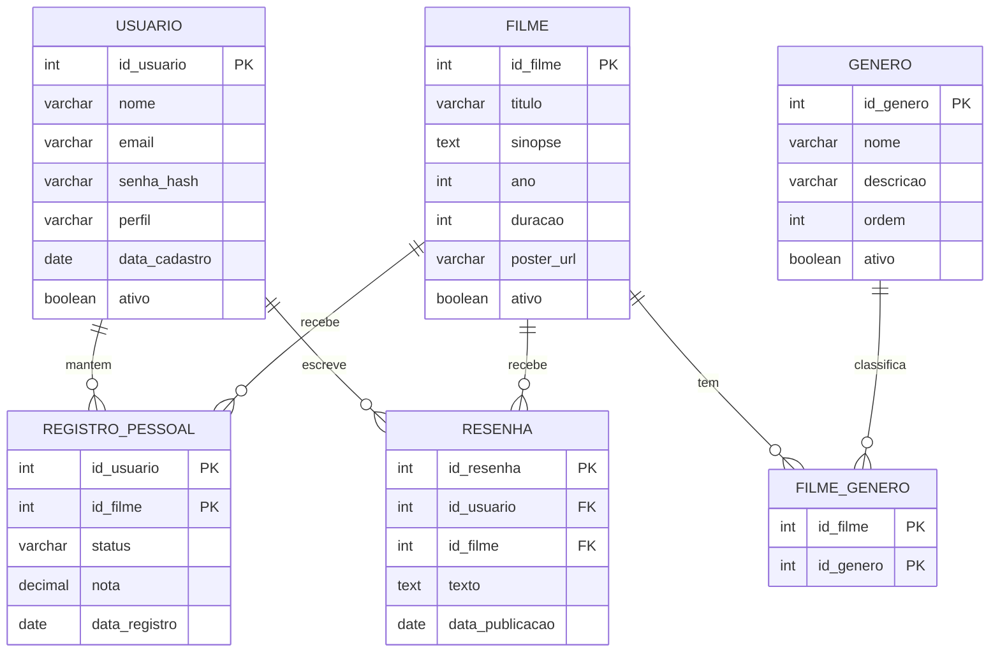

# MER — Modelo Entidade-Relacionamento

**Rascunho para discussão do grupo.**
Entrega obrigatória do **Marco 1 — 17/09/2026**.

Este arquivo parte do esquema que desenhamos juntos e propõe os ajustes que
faltam. Nada aqui está fechado: a ideia é ter um texto para discutir em vez de
começar do zero na reunião.

---

## Visão geral

---

## As tabelas

### USUARIO

| Coluna | Tipo | Regra |
|---|---|---|
| `id_usuario` | INT | PK, auto-incremento |
| `nome` | VARCHAR(120) | obrigatório |
| `email` | VARCHAR(160) | obrigatório, **único** — é o login |
| `senha_hash` | VARCHAR(255) | obrigatório, nunca a senha em texto |
| `perfil` | VARCHAR(10) | `USUARIO` ou `CURADOR`, padrão `USUARIO` |
| `data_cadastro` | DATE | obrigatório |
| `ativo` | BOOLEAN | padrão verdadeiro |

### FILME

| Coluna | Tipo | Regra |
|---|---|---|
| `id_filme` | INT | PK, auto-incremento |
| `titulo` | VARCHAR(200) | obrigatório |
| `sinopse` | TEXT | opcional |
| `ano` | INT | obrigatório |
| `duracao` | INT | obrigatório, **em minutos** |
| `poster_url` | VARCHAR(500) | opcional, endereço de imagem |
| `ativo` | BOOLEAN | padrão verdadeiro |

`duracao` em minutos, número inteiro. A conversão para "2h28" é feita na hora de
mostrar, nunca guardada assim — senão não dá para comparar nem somar.

### GENERO

| Coluna | Tipo | Regra |
|---|---|---|
| `id_genero` | INT | PK, auto-incremento |
| `nome` | VARCHAR(60) | obrigatório, único |
| `descricao` | VARCHAR(255) | opcional |
| `ordem` | INT | ordem de exibição nos filtros |
| `ativo` | BOOLEAN | padrão verdadeiro |

### FILME_GENERO — o relacionamento N:N

| Coluna | Tipo | Regra |
|---|---|---|
| `id_filme` | INT | PK composta + FK para `FILME` |
| `id_genero` | INT | PK composta + FK para `GENERO` |

Um filme tem vários gêneros e um gênero tem vários filmes. É esta tabela que
permite filtrar o catálogo por gênero e calcular a afinidade da funcionalidade
"O que eu assisto hoje?".

### REGISTRO_PESSOAL — a relação entre a pessoa e o filme

| Coluna | Tipo | Regra |
|---|---|---|
| `id_usuario` | INT | PK composta + FK |
| `id_filme` | INT | PK composta + FK |
| `status` | VARCHAR(15) | `QUERO_ASSISTIR` ou `ASSISTIDO` |
| `nota` | DECIMAL(2,1) | 0 a 5, **nula** enquanto o status for `QUERO_ASSISTIR` |
| `data_registro` | DATE | quando entrou na lista |

**Esta é a melhor decisão do nosso esquema.** Em vez de uma tabela para "quero
assistir" e outra para "assistidos" — que seriam quase idênticas —, é uma só, com
uma coluna que diz em que estado o filme está. Mudar de "quero ver" para "já vi"
vira um `UPDATE` de uma coluna, e a chave composta impede o mesmo filme de entrar
duas vezes na lista da mesma pessoa.

### RESENHA

| Coluna | Tipo | Regra |
|---|---|---|
| `id_resenha` | INT | PK, auto-incremento |
| `id_usuario` | INT | FK, obrigatório |
| `id_filme` | INT | FK, obrigatório |
| `texto` | TEXT | obrigatório |
| `data_publicacao` | DATE | obrigatório |

---

## O que mudou em relação ao primeiro rascunho, e por quê

| # | Mudança | Motivo |
|---|---|---|
| 1 | **`RESENHA` ganhou `id_filme`, `texto` e `data_publicacao`** | No rascunho a resenha pertencia ao usuário mas não apontava para filme nenhum, e não tinha onde guardar o que foi escrito. Sem `id_filme` a funcionalidade 14 não funciona. |
| 2 | **`senha` virou `senha_hash`** | Guardar senha legível no banco é falha de segurança que a banca percebe na hora. Gerar o hash é uma linha de Java. |
| 3 | **`FILME` ganhou `ativo`** | `GENERO` já tinha e `FILME` não. Sem essa coluna, tirar um filme do catálogo significa apagar o registro — e junto vai o histórico de quem já assistiu. |
| 4 | **`FILME` ganhou `poster_url`** | Catálogo sem imagem não impressiona na apresentação. É só o endereço da imagem, usado num ``. |
| 5 | **`USUARIO` ganhou `perfil`** | Sem ela não há como separar quem cadastra filme de quem só usa o site. Uma coluna resolve, sem tabela nova. |
| 6 | **`nota` é nula enquanto o status é `QUERO_ASSISTIR`** | Nota de filme não assistido não significa nada. Regra a validar no Java. |
| 7 | **`REGISTRO_PESSOAL` ganhou `data_registro`** | Permite dizer "está na sua lista há 42 dias" na explicação da escolha. É a única coluna que não estava no rascunho original e é **opcional** — sem ela a funcionalidade continua funcionando. |

---

## Três pontos em aberto para decidir em grupo

**1. As listas personalizadas (funcionalidade 8).**
Do jeito que o esquema está, o usuário tem *uma* lista de "quero assistir", não
várias listas com nome. Para ter "Clássicos", "Ver com a namorada", "Terror de
sexta", precisamos de **duas tabelas novas** (`LISTA` e `LISTA_FILME`). Vale
decidir: ou entram no MER agora, ou a funcionalidade 8 sai da lista do Marco 1.
Prometer e não entregar custa mais caro do que não prometer.

**2. Favoritos e "quero assistir" são a mesma coisa?**
A lista tem "Favoritar filmes" (4), "Listar favoritos" (5) e "Remover dos
favoritos" (9) — e também "Marcar como assistido" (7). Se favorito e "quero
assistir" forem a mesma coisa, é só mais um valor na coluna `status`. Se forem
diferentes, precisa de mais uma coluna. Melhor resolver isso antes do MER final.

**3. Qual banco de dados.**
O professor não indicou o SGBD. Precisamos escolher e todos instalarem o mesmo,
senão o script SQL de um não roda na máquina do outro.

---

## De onde vêm os dados dos filmes

**Não podem vir de API** — nem TMDB, nem OMDb, nem nenhuma outra. Isso vale tanto
para consumir quanto para expor uma API nossa.

Então o catálogo é **semeado à mão**: título, ano, duração, gêneros e sinopse
digitados por nós. Entre 60 e 100 filmes, o que dá 15 a 25 por pessoa. É trabalho
chato, mas é o que faz a demonstração parecer um produto de verdade — catálogo com
8 filmes não convence ninguém no pitch.

Comecei um arquivo para isso em `docs/filmes-semente.csv`.
